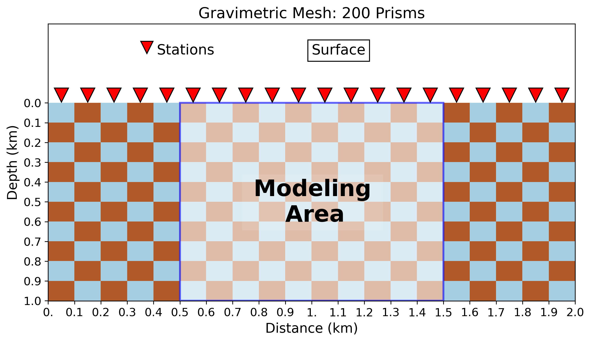
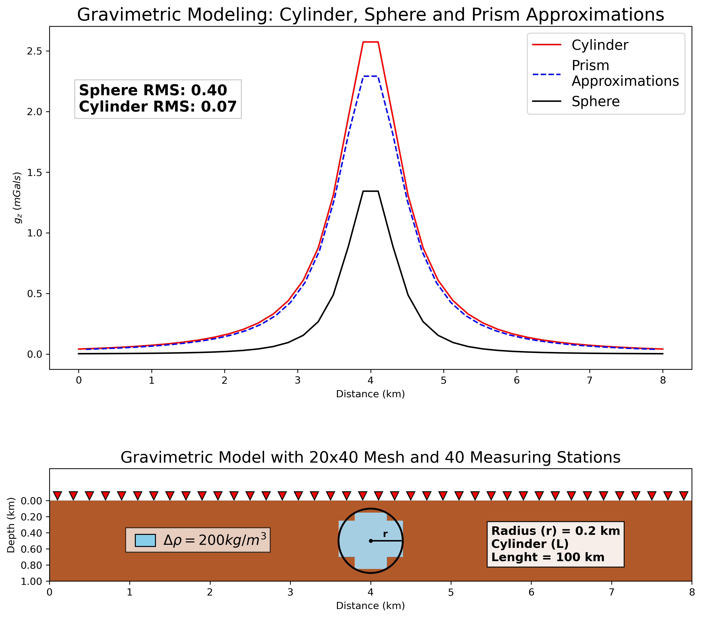

# Gravimetric Modeling with Vertical Prisms

This repository contains a Python implementation of a forward gravimetric modeling tool based on vertical prisms with infinite extension in one horizontal direction. The code is designed to approximate subsurface structures using a discrete mesh of simple geometric blocks.

## Overview

In geophysical modeling, subsurface structures are often irregular and asymmetric. However, when gravity data are acquired at some distance from the source, these structures can be approximated by simple geometries such as vertical prisms. This tool discretizes the subsurface into 200 vertical prisms, each defined by parameters such as top and base depths, horizontal position, thickness, and density contrast.

### Key Assumptions:

* Each prism extends infinitely in the y-direction (2D modeling).
* The modeling domain spans 2 km horizontally and 1 km in depth.
* The target region is 1 km × 1 km; the rest acts as boundary to reduce edge effects.
* Prisms are 0.1 km wide and 0.1 km deep.

## Parameters of Each Prism

* **Top Depth** $z_1$: 0 to 0.9 km
* **Base Depth** $z_2$: 0.1 to 1.0 km
* **Horizontal Width** $t$: fixed at 0.1 km
* **Horizontal Position** $x_q$: 0 to 1.9 km
* **Density Contrast** $\rho$: in kg/m$^3$

The gravity anomaly at each station is calculated based on an adapted version of Luiz (1995) for vertical-faced prisms:

$$
g_z(x) = 2 G\rho \left\{ \frac{(x - x_q)}{2} \ln\left(\frac{z_2^2 + (x - x_q)^2}{z_1^2 + (x - x_q)^2}\right) + \frac{(x - x_q - t)}{2} \ln\left(\frac{z_1^2 + (x - x_q - t)^2}{z_2^2 + (x - x_q - t)^2}\right) - z_2 \left[\arctan\left(\frac{x - x_q - t}{z_2}\right) - \arctan\left(\frac{x - x_q}{z_2}\right)\right] + z_1 \left[\arctan\left(\frac{x - x_q - t}{z_1}\right) - \arctan\left(\frac{x - x_q}{z_1}\right)\right] \right\}
$$


## Mesh and Acquisition Layout

The modeling mesh is structured as 20 rows (depth) and 10 columns (horizontal distance), totaling 200 prisms. Twenty gravimetric stations are positioned at the midpoints of each prism along the surface. The final gravity anomaly $g_{z200}(x)$ is the sum of the contributions of all prisms.



## Validation

To validate the prismatic modeling, the results were compared against the analytical gravity responses of a sphere and a cylinder. The validation used:

* A refined mesh: 40 columns $\times$ 20 rows = 800 prisms
* Radius: 0.2 km
* Density contrast: 200 kg/m$^3$
* Cylinder half-length: 100 km (to approximate an infinite y-dimension)

### Analytical Equations:

* **Sphere**:
  $g_{ze}(x) = \frac{4\pi G \Delta\rho r^3 z_c}{3[(x-x_c)^2+z_c^2]^{3/2}}$
* **Cylinder**:
  $g_{zc}(x) = \frac{2G\pi \Delta\rho r^2}{z_c[1+(x-x_c)^2/z_c^2]} \cdot \frac{1}{\sqrt{1+((x-x_c)^2+z_c^2)/L^2}}$


### Validation Results:

* Sphere modeling with prisms: **\~40% RMS error**
* Cylinder modeling with prisms: **\~7% RMS error**

The approximation for cylindrical bodies proved highly accurate, validating the use of prismatic modeling for elongated subsurface features.



## Usage

To use this model:

1. Clone the repository.
2. Edit the `density_mesh` matrix to define your subsurface structure.
3. Run the script to visualize both the subsurface and gravity anomaly curves.

```bash
python grav_modeling.py
```

## Dependencies

* `numpy`
* `matplotlib`

## License

This project is released under the MIT License.

## Author

Developed by Annie Gabrielle, National Observatory, Brazil.

---

### Optional

You can explore advanced visualization and comparison with analytical models using the provided validation tools and meshes.

Feel free to open issues or submit improvements!
